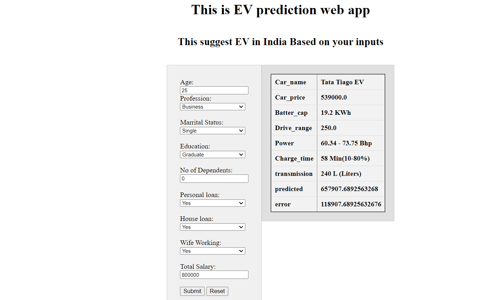

# EV market segmentation
Name: Shreyash Banduji Chacharkar

EV recommedation app:https://ev-segmentation.uc.r.appspot.com/

Github link: https://github.com/ShreyashChacharkar/EV_marketsegment

## Introduction:
The Indian electric vehicle (EV) market has experienced rapid growth in recent years, driven by government incentives and increasing awareness of environmental sustainability. As one of the largest automobile markets in the world, India holds significant potential for the expansion of EV adoption, with a growing number of manufacturers introducing electric vehicles to cater to the increasing demand.

## Web app of EV recommedation system:
This web app help to choose EV based on Age, profession, Marrital Status, Education, No of Dependents, Personal loan,House Loan, wife working, Total Salary.
This uses linear Regression model for recommedation of price and model of car.

Check out report for detail of data analysis of E;ectric vehicle market.
[report](report.md)
